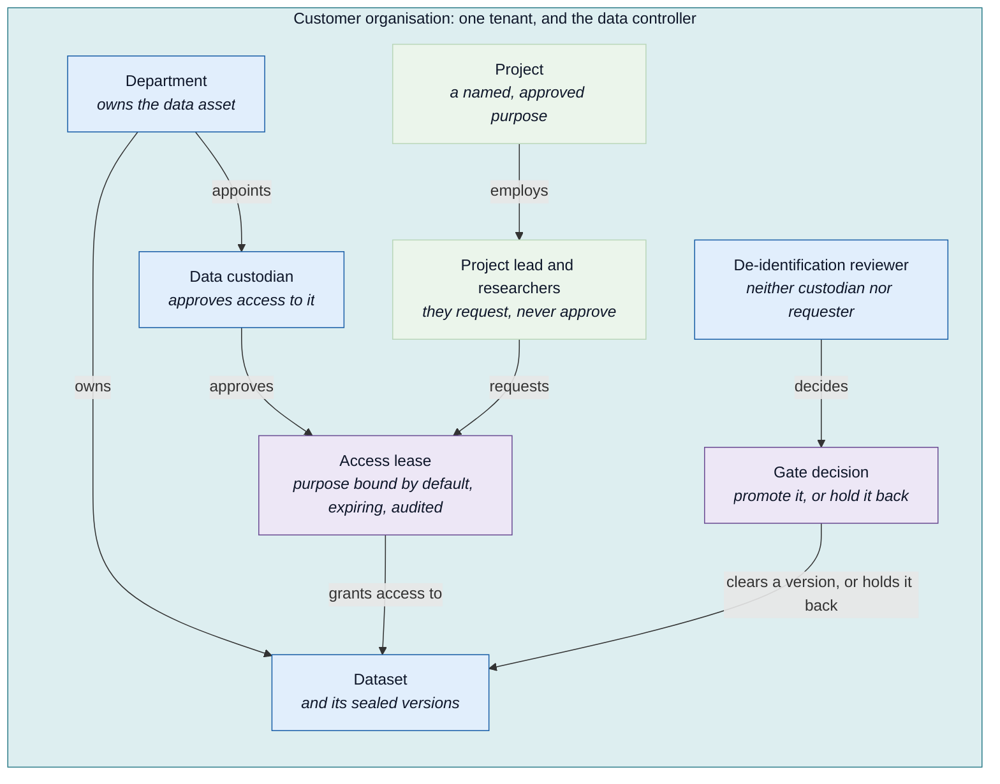

# Munitas: the governance model

Who owns the data, who decides who may read it, and who may only watch.

Every dataset, agent, and pipeline belongs to a department. Every access
decision is made by a named, accountable person, never by the platform
itself. This document describes that model and the schema and policy that
make it enforceable rather than merely documented.

Companion reading: the [walkthroughs](https://albinjacob.github.io/munitas/walkthroughs/feature-walkthrough.html)
for these rules in action, screen by screen.

---

## 1. The platform never decides

The customer organisation is the **data controller**. Munitas is a
**processor**. That distinction is not paperwork, it has a direct consequence for
the design:

> Any arrangement where platform staff approve access to patient data has put the
> processor in the controller's chair.

So the platform's job is to make somebody else's decision **explicit, enforced
and evidenced**. It supplies the mechanism. The customer supplies the authority.

This rules out the two most tempting shortcuts. A platform administrator cannot
be the approver, because they run the system that records the approval. And
Munitas support staff cannot approve anything at all.

---

## 2. The model

The Mermaid block above is this diagram's diffable source: edit it
directly, in place, rather than in a separate file.

**Legend**

| Colour | Meaning |
| --- | --- |
| Blue | The owning side. Holds the data, or decides about it |
| Green | The requesting side. Declares a purpose and asks |
| Purple | The record a decision leaves behind |
| Teal | The customer organisation, one tenant |

### Why approval crosses the diagram

The single most important property is that **approval travels from the
requesting side to the owning side**. That is what turns separation of duties
from a string comparison into a relationship the database can hold.

**Projects may span departments**, and that is precisely why the custodian sits
with the asset rather than with the project. A cardiology dataset used by a
cross-departmental study is still approved by cardiology. Had the custodian sat
on the project, the study would approve its own access, which is self-approval
moved up one organisational level and considerably harder to notice.

### Where this bends in the real world

The shape holds; two variations are common and both fit it.

Some organisations place information asset ownership a level up, at directorate
rather than department. That is the same structure with a different label on the
box.

Research-heavy organisations often replace a single custodian with a **Data
Access Committee**. A department can name several approvers, so a committee is
simply its members, and any one of them may act. The model does not change: the
department is the accountable answer, and each decision names the person who
made it.

---

## 3. Roles

Six personas, each with a reason to open the console.

| Persona | Role | What they do | May approve |
| --- | --- | --- | --- |
| Data custodian | `data_custodian` | Approves access to the departments they are an approver for, confirms sensitivity claims, and may bring data in | **Yes**, access to their own department only |
| De-identification reviewer | `deid_reviewer` | Reads what a de-identification run left behind, and decides whether it may be promoted | **Yes**, the gate only, and never a run they triggered |
| Data protection officer | `dpo` | Reads everything including every denial, evidences compliance, handles erasure requests | No |
| Researcher | `notebook_explore` | Requests access under a project, consumes de-identified data | No |
| Data engineer | `pipeline_operator` | Runs pipelines, brings data in, registers agents and pipelines, diagnoses failures | No |
| Platform administrator | `platform_admin` | Keeps services running | No |

The two approvals are different questions and are deliberately held by different
people. A custodian decides **who may read** a dataset. A reviewer decides
**whether what the pipeline produced is de-identified well enough to be released
more widely at all**, which is a judgement about the data rather than about the
requester. Giving both to the custodian would let the owner of a dataset clear
their own department's output for wider use and then approve the requests to
read it.

### Who brings data in, and who registers code

Bringing data in is the work of two roles: registering a dataset, putting files
into it, fetching it from outside, sealing it and withdrawing an upload. The
**data engineer** does it because it is their job, and the **data custodian**
may do it because they own the data. Registering an agent or a pipeline, or a
version of either, belongs to the **data engineer** alone. Researchers, data
protection officers, reviewers, network architects and the platform
administrator do none of these, and the platform refuses them and says why.

The person who makes a sensitivity claim is never the one who confirms it. Any
one approver of the department that owns the data confirms a claim made by
anyone else. When the person who made the claim is the department's only
approver, another data custodian of the organisation confirms it instead, so
every claim has a second pair of eyes.

A role is held by people, not by a single seat. An organisation may have several
custodians or several data protection officers, and each decision is checked
against the role the person holds.

### Department approvers

Two things are kept apart. A **role** says what kinds of act a person may do,
and it belongs to the person: the data custodian role is asked for by the person,
approved by a different custodian, and confirmed from time to time. A **department
approver** is a position: it says whose data a person answers for. A person is
an approver of a department when they hold the data custodian role and are
listed for that department, and not otherwise. Hartley can be an approver for
Cardiology and not for Oncology, even though he holds the same role as the
approver for Oncology.

A department has any number of approvers, and any one of them may approve access
or confirm a claim, so a department is never blocked by one person being away.
Any current approver may add another or remove one, with a reason that is
recorded with who made the change and when. The person added must already hold
the data custodian role: adding somebody to a department never grants the role.
Temporary cover has an end date and lapses by itself. A department always keeps
at least one permanent approver. The record of who answered for a department is
never edited, so who was accountable on any date can always be answered.

### The data protection officer approves nothing, deliberately

GDPR Article 38(6) bars a DPO from holding a position that leads them to
determine the purposes and means of processing, because they would then be
auditing their own decisions. This is enforced in practice: the Belgian
supervisory authority fined a company 50,000 euro for appointing as DPO someone
who also managed three departments.

Their actual power suits this system unusually well. **They see everything and
decide nothing.** The audit log records every decision including denials, so
read-everything and change-nothing is not a diminished role here, it is the role
the platform was built to serve.

### The administrator has visibility without access

`platform_admin` carries the same class floor as a researcher. Raw data still
needs a lease approved by a custodian.

This is the point rather than an oversight. Administrative power over a system
and access to its contents are different privileges, and merging them means one
compromised account is a breach. The administrator can see **who read what**
without being able to read it.

Honestly stated: in small deployments the administrator and the custodian are
frequently the same person. That is a documented compromise an organisation may
choose, not a violation. The model keeps them separable so the choice is visible.

### HybridOps: operational access without data access

Support engineers and site reliability work need service health, workflow
history, traces, failure reasons and queue depths. They do not need transcripts,
audio or detected spans.

Those are separable here because the discipline is already built. Spans carry
identifiers, counts and classes and never content, and the collector marks
anything arriving without a class as `UNDECLARED` so it shows up rather than
passing silently. Logs and traces are where PHI leaks in real platforms, and that
surface is already constrained.

So HybridOps has **no data-plane access at all** and **no new grant type**. When
an engineer genuinely needs record content, they request an ordinary lease from
the custodian.

That last point is deliberate. The instinct is to build a break-glass mechanism,
but a lease already is one: time boxed, purpose bound by default, approved by
someone else, and logged whether used or not. Reusing it means emergency access
runs through the same audited path as everything else, rather than a second
path that is exercised rarely and therefore trusted more than it is tested.

**A lease's end is enforced where the bytes are, not only where they are
asked for.** The storage permissions document is reprinted from the register
whenever a credential is minted and by a sweep for the rest, so a lease that
has expired or been revoked contributes nothing to the next print and the
key it opened stops working. A key belongs to a lease rather than to a job
title: a lease that is exercised gets its own storage identity, so revoking
one holder's lease cuts that holder without cutting everyone else who
shares the role.

### Purpose limitation, without turning every custodian into a rubber stamp

A lease naming only the purpose it was approved under is purpose limitation in
its plainest form: the reason changes, the decision is asked again. Applied
without exception, it has a failure mode of its own. A workload doing the same
recognisable job for the same custodian, day after day, produces a queue of
requests that differ only in wording. A queue like that stops being read
closely and starts being approved by habit, which is a worse guarantee than
having no queue at all -- the control still exists on paper, but the judgment
behind it has quietly stopped happening.

So a lease carries a `pattern`. `strict` is purpose limitation as above,
the default shape. `simple` is the custodian's
own choice, made once at the moment they approve, that a specific principal
may read a specific dataset version for any purpose while the lease lasts --
not a platform setting, and not something the requester can ask for on their
own behalf. It is refused outright against raw, unreviewed data no matter how
long a principal has held the platform's trust, enforced by a database
constraint as well as by policy, the same two-layer guarantee this document
already asks of self-approval. Below that floor the choice is real: a
custodian who has seen a workload's behaviour and already reviewed the data it
touches can extend it the same latitude a resource owner already extends a
trusted service elsewhere, without that trust becoming a standing grant nobody
ever has to reconsider -- the lease still expires either way. The mechanics of
how this is enforced are in the schema (`access_lease`) and in policy
(`platform/policy/access.rego`) directly.

### Services are not personas

Nobody logs in as a training job. The workloads (`pipeline_action`,
`training_job`, `agent_runtime`) appear in an administrator view showing what
each has been doing. That is evidence rather than impersonation: the agent and
the pipeline already run for real and leave audit rows.

---

## 4. What makes approval trustworthy

Three layers, all enforced.

| Layer | Claim | Enforced by |
| --- | --- | --- |
| Authority | The approver is a registered custodian | Foreign key from `access_lease.approved_by` |
| Relationship | The approver is one of the approvers of the department owning the asset, and is not the requester | Policy, plus a self-approval check constraint |
| Identity | The caller really is that approver | Ory Kratos session, verified by `platform/api/app/auth.py` |

### Human approval is authenticated, not asserted

The `lease_no_self_approval` constraint stops a requester naming themselves
as approver. `approve_lease` and every other human-decision endpoint
(`reject_lease`, `revoke_lease`, `request_lease`, and the agent registry's
`deploy`/`start_run`/`approve_run`) require a real Kratos session
(`Depends(auth.current_session)`): the caller is the session holder, not
whatever name a request body claims.

A registered principal's roles are read from the directory and used to
decide what a request may reach, the same authority-comes-from-the-
directory rule applied throughout this model to `tenant`. A principal with
no directory row at all is refused outright.

Authentication for a human approver runs on Ory Kratos, chosen over
Keycloak (a heavier runtime with more of the login flow built in) because
it self-hosts with a lighter footprint; Descope was ruled out because it
cannot self-host, which would send staff identities and every login event
off the machine.

### A workload proves itself with a spawn-time credential, not a shared secret

`agent_runtime` and `pipeline_action` each require a signed, short-lived
task credential (`platform/api/app/task_credential.py`), minted the
instant a real task begins: an `agent_run` at the moment it starts, an
`action_run` at `POST /action-runs`. The credential is verified by
signature and expiry alone, never by comparing against anything stored.
What it may touch is resolved from that same real row (`agent_run.
dataset_version_id`, or `action_run.input_versions` for a pipeline step's
several inputs, checked by membership), the same authority-comes-from-the-
row rule applied to `tenant` and `roles` above.

`annotation_tool` and any future notebook workspace are standing services
mediating many human sessions over time rather than spawning a single
task, so what needs proving there is which human's session a read is for:
a delegation problem, addressed separately from the spawn-time credential
above.

Every step of the de-identification pipeline proves itself the same way.
Each step opens its own run, which names the versions it reads (the redact
step names two: the result of the step before it, and the recordings it
masks), and the platform decides each read and records it. The first step
(`adopt_version`, reading a dataset version somebody else registered and
sealed) has no run of its own to name, so its credential is scoped to the
whole pipeline run instead, which both workflow engines open before this
step and close once at the end, the same way a cloud CI system scopes a
short-lived credential to the whole job rather than to each step inside it.
That scope resolves from the run's own declared input: its
`source_version_id` column for a console-triggered run, or the
`input_versions` array a DAG engine's own runs can declare several of,
together with the versions its own steps sealed, which the scoring step
reads.

### Writes are justified the same way reads are

No storage role holds standing access to a bucket. A task that reads or
writes is given a key of its own, made for that task, and the key ends with
it. Write access is granted per task through a `write_grant` table
(`platform/schema.sql`), one row per task that has legitimately reserved a
version-location, issued through `POST /write-credentials` after the same
task-credential proof `/credentials` requires for reads, verified against
a real `action_run`, `pipeline_run`, or `huggingface_fetch_job` row rather
than the caller's own say-so. The key a writer receives lets it write the one
folder reserved for its output and nothing else, enforced at the
object-storage layer, not only by the API.

Each pipeline step, each derivation run, each pipeline run and each agent run
reads with a key of its own. The key lists only the input folders the platform
has allowed that task to read, and it contains no listing. It is removed when
the task ends or fails, and when the six-hour life of the task credential runs
out without the task asking again. A task that asks again after waiting, for
example an agent run that waited for a person to approve access, receives its
key again.

---

## 5. Schema implications

| Table or column | Purpose |
| --- | --- |
| `department` table | Tenant, name, and the person the department was made with |
| `department_approver` table | Who answers for each department, since when and until when, and who changed it and why |
| `project` table | Tenant, name, lead, declared purpose, lifespan |
| `dataset.department_id` | Which department owns the asset |
| `lease_request.project_id` | Which approved purpose the request is made under (nullable) |
| Foreign key on `access_lease.approved_by` | An unregistered name is refused by the database |

The foreign key on `approved_by` matters most because it moves the
guarantee into the schema, alongside dataset immutability and the
self-approval check, rather than leaving it in application code where a
future edit can quietly remove it. It is marked `NOT VALID`, which still
enforces the constraint on every new or updated row without Postgres
having to re-check every pre-existing row against it, the usual way to add
a constraint to a table that already has data without locking it for a
full table scan.

`lease_request.purpose` is a required column carrying free text, and
`lease_request.project_id` is nullable, so a lease can be requested with
no project behind it at all. Making a project a required, approved-purpose
reference that every lease must carry, so purpose limitation becomes a
constraint rather than a declaration, is a further tightening the schema
already supports.
